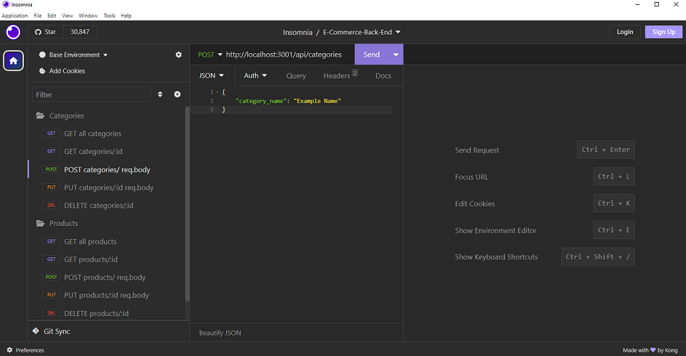
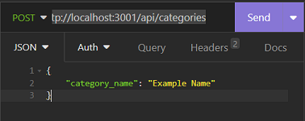
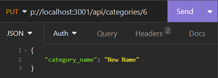
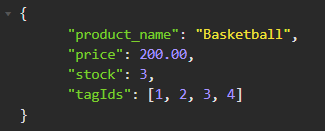

# <Your-Project-Title>E-Commerce-Back-End

## Description [](https://opensource.org/licenses/MIT)

- What was your motivation?

        To build an back-end system to track products/inventories

- What problem does it solve?

         Convenience for an inventory manager/business owner to track and manage their products/inventories

- What did you learn?

        Sequelize models, and Object Relational Mapper

## Table of Contents

- [Installation](#installation)
- [Usage](#usage)
  - [Categories](#categories)
  - [Products](#products)
  - [Tags](#tags)
- [Credits](#credits)
- [License](#license-and-badges)
- [Additional Info](#additional-infomation)

## Installation

Run in integrated terminal with the command

- To insert/import existing data from the seed

```
    npm run seed
```

- To start the server

```
    npm start
```

## Usage

After starting the server, use [**Insomnia**](https://insomnia.rest/download) app



With the app, a user can **create, read, update, delete** in categories, products and tags section.

### Categories:

[**Categories**](#categories) || [**Products**](#products) || [**Tags**](#tags)

- To **READ/retrieve ALL** existing categories, use **GET** request with the end point

```
http://localhost:3001/api/categories
```

- To **READ ONE** specific category, use **GET** request and replace the "**_`id#`_**" with its associated id number

```
http://localhost:3001/api/categories/id#

example: to read the category with id number of 5, use
 http://localhost:3001/api/categories/5
```

- To **CREATE** a new category, use **POST** request and with the end point, replace "**_`Example Name`_**" in the body with your desired name



```
http://localhost:3001/api/categories
```

```json
{
  "category_name": "Example Name"
}
```

- To **UPDATE** an existing category, use **PUT** request and replace the "**_`id#`_**" with its associated id number

```
http://localhost:3001/api/categories/id#

example: to update the name of category with id number of 6, use
 http://localhost:3001/api/categories/6
```

In the body, replace "**_`New Name`_**" with your desired name and click send.



```json
{
  "category_name": "New Name"
}
```

- To **DELETE** an existing category, use **DELETE** request replace the "**_`id#`_**" with its associated id number

```
http://localhost:3001/api/categories/id#

example: to delete the name of category with id number of 2, use
 http://localhost:3001/api/categories/2
```

### Products

[**Categories**](#categories) || [**Products**](#products) || [**Tags**](#tags)

- **READ/DELETE** please refer [**Categories**](#categories) section, and end points for products are

> **READ ALL** http://localhost:3001/api/products

> **READ ONE** http://localhost:3001/api/products/`id#`

> **DELETE** http://localhost:3001/api/products/`id#`

- **CREATE** a new one product with **POST** request, the end point is

```
http://localhost:3001/api/products
```

In the body, please

- Replace `Example Name` with your desired product name
- Replace `Price` with a number, for example $19.99 input as 19.99
- Replace `Stock` with a number, and it has default value of 10.
- Replace `id#` with the associated tags you would like to have with the product

```json
{
  "product_name": "Example Name",
  "price": "Price(Number)",
  "stock": "Stock(Number)",
  "tagIds": ["id#", "id#", "id#"]
}
```

Example of creating a new product named **Basketball** that has price of **200.00**, **3** in stock, and its associated tags id are **1, 2, 3, 4**



- To **UPDATE** an existing category, use **PUT** request and replace the "**_`id#`_**" with its associated id number

```
http://localhost:3001/api/products/id#
```

and update the information about the product as the body format,

to remove an associated tag id, just remove the `id#` and leave the one(s) you need in the `[ ]`

```json
{
  "product_name": "New Name",
  "price": "New Price(Number)",
  "stock": "New Stock(Number)",
  "tagIds": ["New id#"]
}
```

### Tags

[**Categories**](#categories) || [**Products**](#products) || [**Tags**](#tags)

- **READ/DELETE** please refer [**Categories**](#categories) section, end points are

> **READ ALL** http://localhost:3001/api/tags

> **READ ONE** http://localhost:3001/api/tags/`id#`

> **DELETE** http://localhost:3001/api/tags/`id#`

- **CREATE** a new one product with **POST** request, the end point is

```
http://localhost:3001/api/tags
```

In the body, replace `Tag Name` with your desired tag name

```json
{
  "product_name": "Tag Name"
}
```

- To **UPDATE** an existing tag, use **PUT** request and replace the "**_`id#`_**" with its associated id number

```
http://localhost:3001/api/tags/id#
```

In the body, replace `New Tag Name` with your desired tag name

```json
{
  "product_name": "New Tag Name"
}
```

## Credits

Class REPO examples, and Wayne

## License-and-Badges

[](https://opensource.org/licenses/MIT)

---

## Features

Back-end product/inventory management system

## Tests

none

## Additional-Infomation

Github: https://github.com/wayne80361

Email: wayne80361@gmail.com

REPO LINK: https://github.com/wayne80361/E-Commerce-Back-End-Wayne

Video Link: https://drive.google.com/file/d/1W6DKZue4hI7AzbUJoV9SxnvKEvV9gkoO/view
